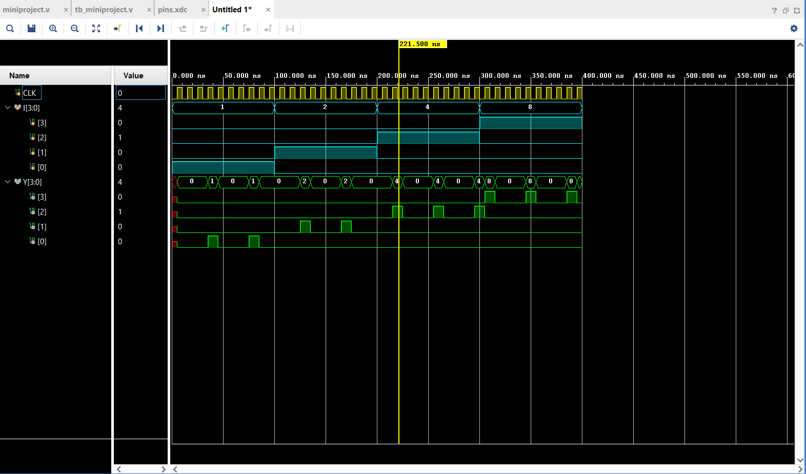

# 03 - Simulation

This folder contains the simulation testbench and output results for the FPGA mini project.

## Testbench Overview

**File**: `tb_miniproject.v`

- Simulates the top-level module `miniproject.v`
- Generates a 100 MHz clock signal (10 ns period)
- Applies a sequence of 4-bit input values to `I`
- Observes output `Y` for verification

## How to Run the Simulation

1. Open your Vivado project
2. Add all Verilog source files from `02-verilog-modules/`
3. Set `tb_miniproject.v` as the top module for simulation
4. Run **Behavioral Simulation**
5. Observe the output waveform in the simulator

## Simulation Result

---

This simulation verifies correct integration of the MUX, Decoder, Latch, and Counter modules in the top-level design.
